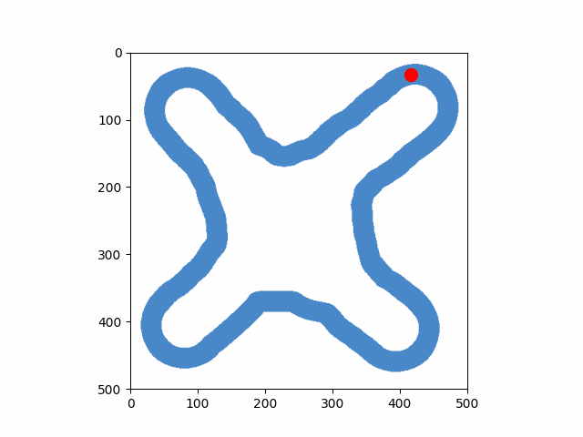

# Diffusion-based Imitation Learning

The model uses here is originally proposed by Tim Pearce et al.
Original work can be found,

GitHub: https://github.com/microsoft/Imitating-Human-Behaviour-w-Diffusion

Paper: https://arxiv.org/pdf/2301.10677

### Setup environment
Use following bash commands to setup torch environment.
Make sure to install suitable torch version (with or without cuda) depending on your HW.

```bash
python -m venv .venv
source .venv/bin/activate
pip install -r requirements.txt
```

### Generate dataset
New dataset (line follow) was generated as seen in the following figure.



Use following command to generate the dataset.
Make sure image files are in the `datasets/line_follow/imgs`

```bash
python generate_dataset.py
```

### Model training
To train the model use following commad.

```bash
python train_line_follow.py
```